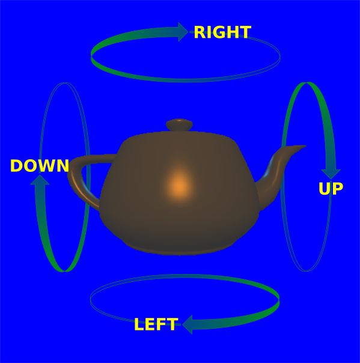
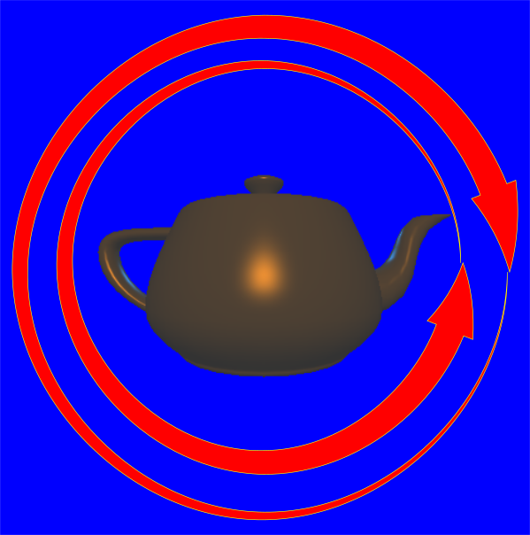

# Homework 1: Transformations

## Introduction
The purpose of the homework is to fill in the code to allow rotation of the viewpoint around a scene, using what is known as a crystal ball interface.  Please be aware of all pages of the assignment before starting; in particular we have a detailed FAQ and helpful hints on the final tabs.  

The assignment was designed with two main goals, as a gentle introduction to the course and initial material on transformations. The first goal is to understand how viewing and other transformations are used to render scenes. You will implement a simple crystall ball interface, standardly used for viewing, and also see how to build up the standard transformation matrices for this purpose.

The second goal is to get some initial familiarity with OpenGL so you can be set up for the next assignment. In particular, the assignment skeleton is written in modern OpenGL and GLSL. It also uses the modern GLM OpenGL Mathematics library, available at http://glm.g-truc.net. The library and zip file are included in the skeleton to save you the trouble of downloading it. For this assignment itself, you do not strictly need to know much about OpenGL or shaders, but try to look through the main program and shaders to get a sense of how it all works. You are welcome to play around with it and explore; try to understand the solution framwork. For guides to OpenGL, GLM and GLSL, please see the course handouts, available from Updates.  (The main in-class CSE 167 website also has many links).  Some of you may also want to browse ahead to unit 2 in the courseware that introduces OpenGL and builds up the program in homework 0.  

While the actual coding work is minimal, some thinking is needed. You may also run into unexpected problems with OpenGL, GLM, or GLSL for this first assignment. Post any questions you have to Piazza or to the discussion forums, since other students will want to see the answers too. **However, do not post anything resembling code.**

## Download Frameworks
Please download the code frameworks from the local CSE 167 website under assignments.

## Assignment Specification
You will be implementing a classic crystal ball interface. This simulates a world in which the viewer is glued to the outside of a transparent sphere, looking in. The sphere is centered at the origin, and that is the direction towards which your eye is always pointing. At the origin, there is something interesting to look at, in this case, a teapot.

You can change the viewpoint by rotating the crystal ball in any direction about the origin. In this case, the rotation will be controlled by keyboard input. You must think about how the position of the eye and direction of the up vector change with left-right or up-down rotations.

Fill in the parts of Transform.cpp that say "//FILL IN YOUR CODE HERE". First, you should fill in left() and up(). Once these are working, fill in lookAt(). You must also fill in the helper function rotate() and you can use it in your code (this function simply sets up the rotation matrix for rotation about a given axis; you can use the Rodriguez formula from the lectures). **Do not modify any files except for Transform.cpp.**

Please see the images below (originally courtesy of "JenkinSD" refined by Jcoppens) for a visual explanation. The first (left) image clarifies which direction each keyboard key rotates (doesn't correspond exactly to function names in the code). It doesn't matter if you think left/right or up/down are swapped; your sign convention must simply match the images from the reference solution. The right image shows an incorrect result: the teapot should never rotate in the manner shown.





##Helper Functions and Restrictions
You may use glm::dot, glm::cross, glm::transpose and glm::normalize to operate on vectors for standard dot-products, cross-products, matrix transposes and normalization. You do not strictly need to, but you may also use glm::radians and matrix-vector or matrix-matrix multiplication from the glm library (via overloaded operators). **You may not use other glm or OpenGL functions**, except for overloaded operators for arithmetic operations and array subscripting.

## Submission
Please note that some of the instructions below refer to code graders, but we are not utilizing them for this class instance (Winter 2023).  You will only be submitting to image graders. 

For submission, you will run your HW1 assignment with "input.txt" as its first command line argument. Once the program is running, press i. This will generate screenshots of your program, such as "input.txt.001.png", which you will submit in a zip file named "hw1.zip".  Separately, you will be submitting  Transform.cpp  for our code-grader.  Both image and code-graders compare your solution against the reference solution.  Code-grading is more accurate since both systems will run on the same machine (different machines give somewhat different images, and we have adjusted our tolerances accordingly; do not worry about small numbers of pixel errors if you pass the test).  Note that both code and image graders are provided on the submission page.  

Please note that you can submit as many times as you like before the deadline, using the feedback to improve and refine your solution.  Please follow the honor code, and only submit code and images generated from a program that you yourself have written.  On no account may you submit malicious code or otherwise try to circumvent the normal operation of the grader; failure to follow these rules will be dealt with strictly, and all submissions will be logged.    

Finally, please note down the URL for the full-resolution versions of the images from code and image grading.  **Besides the UCSD Online submission and feedback, you must "officially" submit your homework for CSE 167 following the instructions on the CSE 167 main assignments page.  That submission must include links to the code and image URLs from your UCSD Online submission.**

On OSX, a zip file can be made by selecting the files, right clicking and selecting "Compress". On Linux, this can be achieved using the zip program. On Windows, you may download WinZip to make a zip file (select "Download Trial").

In Visual Studio skeletons, the command line argument is already specified (under Projects -> Properties -> Configuration Properties -> Debugging -> Debugging -> Command Arguments). On OSX/Linux, this can be done by running ./transforms input.txt in the homework directory.

## Solution Binary
We have compiled a solution on various platforms, named similarly to transforms_sol.exe on windows and reference-solution-linux or reference-solution-osx  for linux/osx (different platforms will have slightly different names of the solution program. The binary may not work on some Linux systems due to compatibility issues, but you can always use the autograder for feedback.). Your solution must behave identically. In addition, the skeleton code allows the use of the g key to toggle between using the system (GLM) lookAt command and yours (initially set to the system command). One verification is to press the arrow keys a few times and then hit g to toggle and verify that your lookAt() matches the system version. This verification is usable even if you are on a different platform and cannot get the pre-compiled solution to work. Note though, that you still need to follow the pre-compiled solution in terms of its sign conventions and behavior for left() and up().  We are aware that our sign conventions may not be intuitive to everyone, but there is no "right" way, so please follow the solution exactly.  

## Caveats on Row vs Column Major
OpenGL and GLM store matrices in column-major order. Extra care must be taken when defining the elements of a matrix individually. For example, the matrix:

$$\begin{pmatrix}
a & b & c\\
d & e & f\\
g & h & i
\end{pmatrix}$$

would be defined by the following code using GLM:
```
glm::mat3(a,d,g,b,e,h,c,f,i)
```
This is contrary to a row-major definition, which would have the elements defined in alphabetical order. 

An alternative approach might be to simply transpose the matrix before further operations.  
```
glm::mat3 m(a,b,c,d,e,f,g,h,i); m = glm::transpose(m); 
```
This confusion only applies to matrices defined explicitly by specifiying elements.  Once you have defined a matrix, matrix-vector and matrix-matrix operations work as expected (keeping the matrix in column-major form).  Nevertheless if you are confused, we recommend that you avoid matrix-matrix multiplications, and use matrix-vector multiplication sparingly for this assignment.

We will discuss syntax to specify glm and operate on matrices later.  

## Basic Hints
You are not required to use or refer to any of the material in these hints, but they are likely to be useful to you.  A more detailed FAQ and step-by-step hints are found later.  This mainly pertains to the material needed in Transform.cpp which is all you need to modify (do not change any other files). main.cpp is reasonably documented, and one goal is for you to try to learn some OpenGL if you want to look at it in more detail.

#### Rotate
Rotate just implements the standard axis-angle formula to create a rotation matrix. This is a good exercise in correctly coding vectors and matrices. You will of course need to use standard trigonometric functions and convert degrees to radians.  Please note that namespaces are properly set up so you can simply do sin(angle), cos(angle) in your code.  You can also specify glm matrices simply with mat3 M; without the glm::mat3 qualifier being needed.  

#### Left
The simplest function to fill in is left. The input is the degrees of rotation, the current eye 3-vector and current up 3-vector. Note that you may need to convert degrees to radians (in the standard way) to set up a rotation matrix. Your job is to update the eye and up vectors appropriately for the user moving left (and equivalently right). This function should not require more than about 3 lines of code to do the appropriate rotations.

#### Up
The up function is slightly more complicated, but satisfies the same basic requirements as left. You might want to make use of helper functions like glm::cross and auxiliary vectors. Again, you need to update the eye and up vectors correctly.

#### lookAt
Finally, you need to code in the transformation matrix, given the eye and up vectors. You will likely need to refer to the lecture videos, and especially the derivation of gluLookAat to do this. It is likely to help to define a u v w coordinate frame (as 3 vectors), and to build up an auxiliary 4x4 matrix M which is returned as the result of this function.

## Compilation
Most compilation issues should have been resolved with HW 0.  Please read on only if you have problems.  For Linux, if you get errors with usleep not being in scope, please see the FAQ for HW 0 and include unistd.h  from grader.h  For OSX users with XCode, you may need to configure the command line argument.   For example, click on the active Scheme, select 'Edit Scheme...' in the 'Run Scheme' option, select the 'Arguments' tab, add an argument ('input.txt') via the plus button.  This may be necessary to run the grading tests.  Some users have also reported that grader.cpp must be manually added in OSX and Xcode.  To do so, go to the project settings, 'Build Phases' then 'Compile Sources' and add grader.cpp to the list (you will need to do this for HW 2 as well).  You may also need to add '$(SRCROOT)/YOUR-PROJECT-NAME/' to the user search paths, in order to find glm.hpp Finally, please ignore deprecation or other warnings, as long as the program compiles and works.

For MacOS (and possibly others), if the code compiles on your system, but Transform.cpp doesn't compile on the code grader, it may be related to definitions of trigonometric functions sin and cos.  Please use glm::cos() and glm::sin() or cosf() and sinf() instead.  There may be other issues related to "error: no match for 'operator *'".  This sometimes occurs when attempting to perform scalar-matrix multiplication using *, and can be fixed by casting the scalar to a (float) explicitly.  

## Skeleton Code
When you compile the skeleton code for HW1, the arrow keys will not work. You must add this functionality.

## Grading
For grading, you need to run the program with input.txt as the argument.  If you forget to do this, you may get an error message saying no input file specified for grader.  For a command-line system, such as Linux or Mac OS, the correct command would simply be ./transforms input.txt  For visual studio, we should already have specified the command-line argument in the skeleton.

## Black Output
If your output image files are black, especially on Linux, try making a similar change as suggested in homework 0.   Replace the first few lines of saveScreenshot (in main.cpp) with: 
```
void saveScreenshot (string fname) {
     int pix = w * h; 
     BYTE * pixels = new BYTE[3*pix] ;
     // glReadBuffer(GL_FRONT); glReadBuffer(GL_BACK);
    glReadPixels(0,0,w,h,GL_BGR,GL_UNSIGNED_BYTE, pixels);
```
## Common Math Constants/Functions
pi, cos, and sin should be defined for you when you are modifying Transform.cpp. Note that cos and sin take radians. Example:
```
cos(90.0 * pi/180.0);
```
## GLM Matrix and Vector Setup
Read the documentation links below for details of glm.  To summarize, the most common vector/matrix operations are as follows: 

To define three vectors and two 3x3 matrices, with the last being the identity (simply use mat4 instead of mat3 for 4x4 matrices).
```
vec3 u,v,w ; mat3 R;  mat3 I(1.0) ; 
```
Individual elements of a vector and matrix can be set directly, for example:  
```
u[0] = 0; u[1] = 1; u[2] = 0; R[0][1] = 0.5;
```
(If you set matrix elements directly as above, please note that GLM and OpenGL store matrices in column major order, and you may therefore need to transpose the matrix at the end: R = glm::transpose(R);) 

Standard matrix-vector and other operations are permitted such as:
```
w = glm::cross(u,v); w = glm::normalize(w); u = R * u ;
```
Let's do a simple example.
```
vec2 v = vec2(10.0, 20.0);
mat2 m = mat2(1.0, 2.0, 3.0, 4.0); 
// Remember this is column major.  Equivalently,
// mat2 m; 
// m[0][0]=1.0; 
// m[0][1]=3.0; 
// m[1][0]=2.0; 
// m[1][1]=4.0; 
// m = glm::transpose(m) ; 

vec2 w = m * v; // = vec2(1 * 10 + 3 * 20, 2 * 10 + 4 * 20)  
```
## Linux Solution Binary
The linux binaries may not be portable across platforms and architectures. Either run the solution elsewhere or just use the autograder as a feedback server for verification; it should not affect your ability to do the assignment.

## Left/Right Keys
You must match the reference implementation and autograder exactly, in regards to the interaction with the left/right/up/down buttons. Left will rotate the teapot left, and up will rotate the tepot down. 

## Turning Left or Right on Left Key?
You should try to match the given solution *EXACTLY*. (In this case, turn the teapot left or similarly move the viewpoint to the right )

## Missing GLUT.DLL or GLEW.DLL
If your system complains about this missing from SYSROOT, then just put them in the HW1 DEBUG directory.

## Useful URLs
Here are some URLs that may be useful to you in homework 1.  These are all linked from the course handouts that you may want to browse.

1. [Wikipedia Article on Rotation Matrix](https://en.wikipedia.org/wiki/Rotation_matrix)
2. [GLSL Types](https://www.khronos.org/opengl/wiki/Data_Type_(GLSL))
3. [open gl reference card](https://www.khronos.org/opengles/sdk/docs/reference_cards/OpenGL-ES-2_0-Reference-card.pdf)
4. [Vector and Matrix Operations](https://en.wikibooks.org/wiki/GLSL_Programming/Vector_and_Matrix_Operations)
5. [GLM Documentation](http://glm.g-truc.net/0.9.4/index.html)

## GLM Documentation
[GLM Trig Functions](http://glm.g-truc.net/0.9.4/api/a00136.html)

- [cos](https://registry.khronos.org/OpenGL-Refpages/gl4/html/cos.xhtml)
- [sin](https://registry.khronos.org/OpenGL-Refpages/gl4/html/sin.xhtml)

[GLM Geometric Functions:](http://glm.g-truc.net/0.9.4/api/a00131.html)

- [cross](https://registry.khronos.org/OpenGL-Refpages/gl4/html/cross.xhtml)
- [dot](https://registry.khronos.org/OpenGL-Refpages/gl4/html/dot.xhtml)
- [normalize](https://registry.khronos.org/OpenGL-Refpages/gl4/html/normalize.xhtml)

Note: You can click on GLSL man pages to view more documents.

## What to do:
HW1 is about just filling in four functions in the given code to do two things: turn a teapot image horizontally and vertically. Well, actually this is what it looks like, we are in fact moving our camera: see the "crystall ball interface" explanation in the first page (Introduction) of the homework.

Four functions for two things? Yes. Transform::left and Transform::up are called to do the deeds, but they should refer to and use Transform::rotate to do it. And the fourth function Transform::lookat is just for us to learn how to play with matrices and vectors of geometry to perform the lookat function. In fact, I think you may actually start working on it independently from the other three functions but it is better to leave it to the end.

All your code could take up to 10 to 20 lines of code really, so do not despair. The tough part is understanding, not coding.

If we get into more details, the left and up keys will be changing your camera locations by turning your camera around the "crystal ball"... This is unfortunately not a rotation around a fixed axis, well at least not after you start mixing horizontal and vertical movements. So you will need two vectors: eye and up... eye is your camera position, luckily always the same distance from the object (teapot) center, just revolving around a "crystal ball" for this exercise. And up is your second vector to figure out which way is, well, up! In fact, once you are revolving all around the "crystal ball", you would need to know the "up" direction in order to know which direction would be the "left" too. Hence, both "left" and "up" functions have the two vectors "eye" and "up" as arguments in addition to the "degrees" to turn. Speaking of degrees, remember that computer trigonometry operates on "radians" instead of "degrees", so a conversion will be necessary.

Once you know what direction (or around what arbitrary axis) you will turn thanks to your eye and up vectors, you can simply make use of the rotation matrix your code in Transform::rotate will provide you with. As you noticed, left and up are void functions, while rotate returns a mat3 and lookat returns a mat4.

This was all about the coding part to help you start. I am afraid I cannot get into more details from this point on as now you will have to figure how to apply the materials in the lecture for your implementation. 

## What we will get:
At the end, if all is done correctly, the teapot will rotate towards left when we press left and down when we press up. Make sure when you turn it all the way around (especially in the up direction), the teapot does not make sudden 180 degree turn.  If it does, that means there is a problem with your implementation.

When you press "g" nothing will happen if you correctly implemented your Transform::lookat function because both your code and the gluLookAt code will be showing the same view and you will not be able to see a difference.

Finally, you will simply press "i" and the code will perform its magic to produce pre-planned movements (from the "input.txt" file passed through the command line) and taking pictures of their results. You will zip those image files as explained in the submission page and hopefully be done to play around with your code at your own pleasure. You do not need to bother with passing file name in the command line argument if you are using Visual Studio skeletons; otherwise, well, you do...

## glm framework you'll wish you know:
First, you have the objects (data types) to begin with... They are things like vec2, vec3, vec4, mat2, mat3, mat4 and more... But the kinds you will be using are even less in number than the ones I mentioned here. "vec"s are for vectors (one dimension) and "mat"s are for matrices (two dimensions). The number that follows indicate their dimensions so vec3 is a 3x1 vector and mat3 is a 3x3 matrix. You can declare and initialize and assign them as you would with other data types, such as:
```
    vec3 myVector = vec3(1.0, 2.0, cos(radians));
    mat3 myMatrix = mat3(1, 2, 3, 4, 5, 6, 7, 8, 9);
```
However, you may use some functions with vectors and matrices shown in the lectures as inputs to assign values. Here are some useful glm functions:
```
    glm::cross(firstVector, secondVector) //cross prod.
    glm::dot(firstVector, secondVector)   //dot prod.
    glm::normalize(singleVector)          //normalize
    // argument vectors are of type vec3 in our case
```
Oh, there is also the matter of accessing single values within the vectors or matrices. You can do that as you would with arrays such as eye[0], eye[1] or eye[2]. But you can also use eye.x, eye.y, and eye.z to the same effect.

## My recommendations for starting:
These are not necessary, but will probably come in handy for noobs like me at the beginning...

You may consider putting the following line in your Transform::left and Transform::up functions to see what is happening to your eye (and/or up) vectors for debugging purposes:
```
    printf("Coordinates: %.2f, %.2f, %.2f; distance: %.2f\n", eye.x, eye.y, eye.z, sqrt(pow(eye.x, 2) + pow(eye.y, 2) + pow(eye.z, 2)));
```
If the final number (the distance) seems to be changing in this output, it implies that something's wrong! 

Again, if you are a noob like me, start by using simple implementations of the eye and up vectors in the corresponding functions (without coding or using the rotate function) to see what is happening. You can use the 2D rotation formulas for this and this is, of course, incorrect; but it will give you a feeling of what the code does. It is also a pleasure having that teapot dance around early on. If you take this path, you may also encounter some other problems like the teapot moving towards you or away from you but do not mind it at this point, hopefully when you incorporate 3D axis rotations through the rotation function's returned matrix later, things will improve.

I started by having the left function always turn the view around the vertical (y) axis (again, incorrect) to feel some accomplishment. Then I implemented the rotate function (which returns a mat3, if you remember, obviously to be used somewhere) and use it within the left function. When you complete these steps, it is time for the up function, which is a little bit trickier. Of course, if you prefer, you can also make another incorrect implementation for the up function (as I did) just to see that teapot doing more complicated stuff. With the rotate function in use, you will strive to make your left and up functions do the correct things and you may even find out other problems in your left and rotate functions after you have a go at the up function. But believe me, when the teapot starts turning on your screen, you feel more easy doing new things. (That does not mean it gets easier, it's just how you feel...) 

One important remark on your "up" direction (vector): if you are wondering why on earth the direction of up would ever need to change, the simple answer is: you are no longer standing on the earth. :) Think of when you move your camera (eye) right at the top of the teapot, looking down at it; at that point, the "up" direction for the teapot (or the "real world") is quite different from the "up" direction for your camera. ;) Also when you go up a 180 degrees, you (camera) will be seeing the teapot upside down, right? That's another example of your "up" being different from the "real world up".

I cannot say much about the lookat function except that once you implement it, you finally get out of the teapot (when you press "g"). Three things to look out for:

1. The original code just returns an empty mat4 object. Remember to return the mat4 object you constructed by updating the return call at the last line as indicated in the comment in the code.

2. If you see nothing but the blue emptiness, maybe you are looking at the wrong direction? Try checking your +s and -s in calculations.

3. If the teapot seems (or moves) wobbly, you may either be making a mistake in your calculation or some mix up with your vectors.

Oh, by the way, the moment pressing "g" does not seem to work is the moment your lookat function started working... :)

Finally maybe a checklist may be helpful at the very end before you submit:

1. Does your teapot turn left when you press left, and turn downwards when you press up (you know its actually the camera moving in the other direction but it is easier to state it this way)? If so, your directions are correct for the grader specs.
2. Do you see no difference (except some message lines popping up in your terminal window) when you press "g" on your keyboard? If so, you successfully implemented your lookat function.
3. Does the teapot stay at a fixed distance no matter how you turn it?
4. When you mix left and up movements randomly and do full 360 degree turns, does the teapot turn smoothly, without making sudden 180 degree jumps (no sudden upside down turns or switching the handle and spout)? If it does, you better check what you do with your eye and up vectors in the code.
5. This, I am just guessing, but if pressing "i" does not start an automatic routine to take images of some pre-determined rotations, you will probably have to check if the provided "input.txt" file is supplied as a command line argument to your code. VS users will probably never have this problem as it is set in the skeleton code of the project but may still go through the menu system to see it there; other systems will have type them in their command line running the code.
